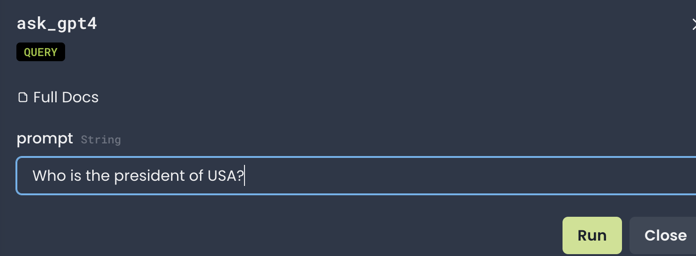
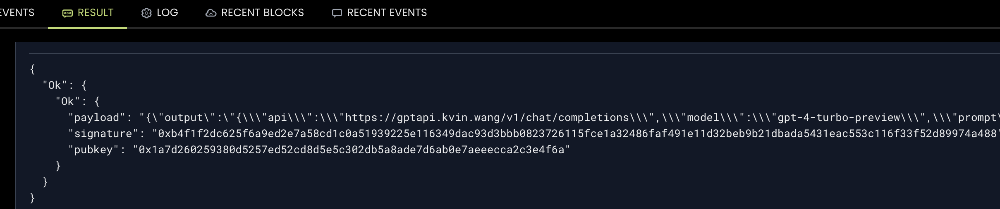

# GPT Prover

This Phat Contract is a GPT prover that can be used to prove that a given openai GPT model was used to generate a given text.

## Asking Questions to Different GPT Models

The contract provides multiple entry points for asking questions or sending prompts to different versions of the GPT model. Depending on the desired model's complexity or capabilities, users can choose between general or specific functions like `ask_gpt`, `ask_gpt4`, or `ask_gpt3n5`.

```rust
pub fn ask_gpt(&self, model: String, prompt: String) -> Result<ProvenOutput, String>

pub fn ask_gpt4(&self, prompt: String) -> Result<ProvenOutput, String>

pub fn ask_gpt3n5(&self, prompt: String) -> Result<ProvenOutput, String>
```

## Deployed Contract

The contract is deployed on PoC6: [Address](https://phat.phala.network/contracts/view/0xb485627babb8c67a0bbdcfdb2e336a864fa9a1ca4393b52667467b2be18d63d3)


You can the contract by opening the link above and picking up one of the available functions as show below:



It would return a JSON object containing the output of the GPT model, other information about the runtime environment and the signature of the output.


